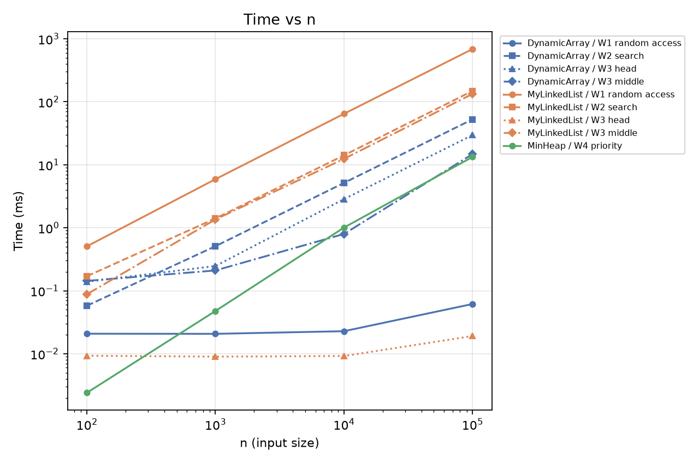
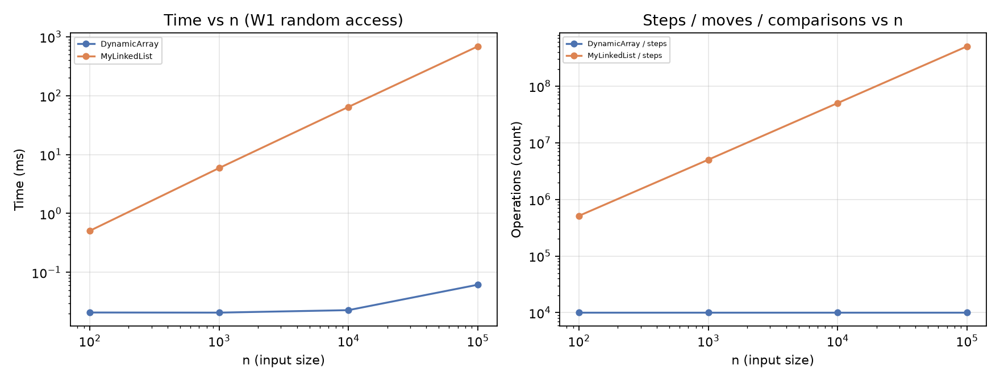
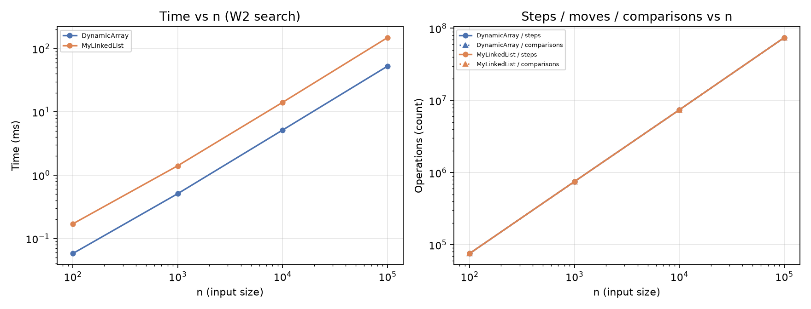
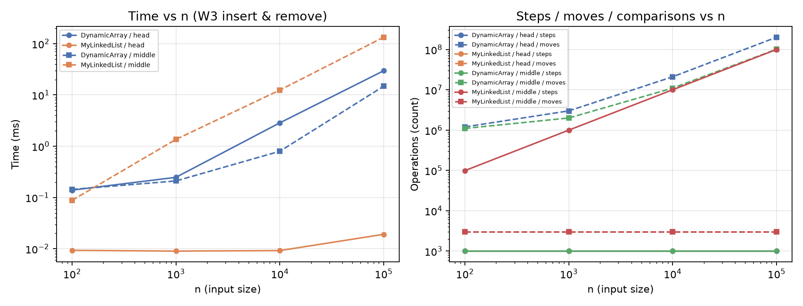
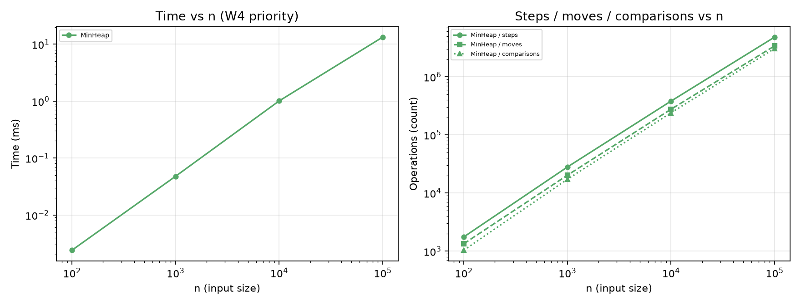
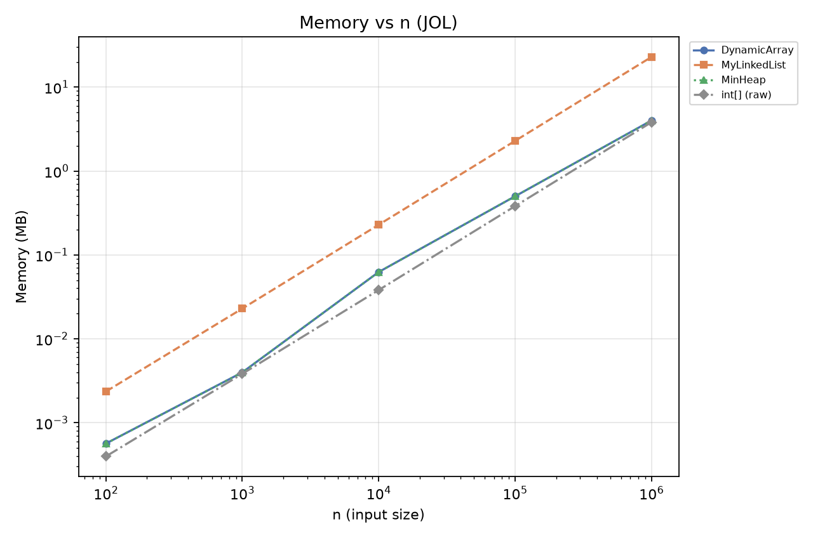
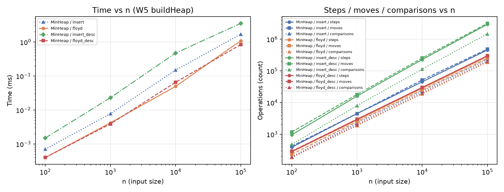

# Assignment 2 — Data Structures: Report

`DynamicArray` (`int[]`, 2x growth), `MyLinkedList` (singly linked, head + tail) and `MinHeap` (array-based binary heap)
are written from scratch on primitive `int`. Array and list share the `IntList` interface, so one benchmark runs both.
Setup: OpenJDK 25, seed `new Random(42)`, adaptive warm-up (≥ 3 runs and ≥ 200 ms per case) after a global JIT
warm-up pass, then 5 measured runs; the median is reported. Data: `results/results.csv` (W1–W4),
`results/build_heap.csv` (bonus B), `results/memory.csv` (bonus A).

## 1. Complexity

*n* = number of elements, *i* = index. Θ is used when the bound is tight.

| Structure | Operation | Best | Average | Worst | Justification |
|---|---|---|---|---|---|
| DynamicArray | `get(i)` | Θ(1) | Θ(1) | Θ(1) | address = base + 4·i, one read |
| | `add(x)` | Θ(1) | Θ(1) amortized | Θ(n) | a resize copies n cells, but 1+2+4+…+n < 2n over n appends |
| | `add(i, x)` | Θ(1) | Θ(n) | Θ(n) | shifts n − i cells; best at i = n |
| | `remove(i)` | Θ(1) | Θ(n) | Θ(n) | shifts n − 1 − i cells; best at the last index |
| | `contains(x)` | Θ(1) | Θ(n) | Θ(n) | linear scan; best if x is first, worst if absent |
| MyLinkedList | `get(i)` | Θ(1) | Θ(n) | Θ(n) | i hops from head |
| | `add(x)` | Θ(1) | Θ(1) | Θ(1) | uses `tail`, no traversal |
| | `add(i, x)` | Θ(1) | Θ(n) | Θ(n) | walk to node i − 1, then 2 link updates; i = 0 or i = n is Θ(1) |
| | `remove(i)` | Θ(1) | Θ(n) | Θ(n) | walk to node i − 1; i = 0 is Θ(1), last index is Θ(n) (no `prev`) |
| | `contains(x)` | Θ(1) | Θ(n) | Θ(n) | linear walk |
| MinHeap | `peekMin()` | Θ(1) | Θ(1) | Θ(1) | minimum is always `heap[0]` |
| | `insert(x)` | Θ(1) | O(log n), Θ(1) expected on random data | Θ(log n) | bubble-up climbs ≤ ⌊log₂ n⌋ levels, stops when parent ≤ x |
| | `extractMin()` | Θ(1) | Θ(log n) | Θ(log n) | bubble-down goes ≤ ⌊log₂ n⌋ levels; best if all values are equal |
| | `buildHeap(a)` | Θ(n) | Θ(n) | Θ(n) | Σ h·n/2^{h+1} ≤ n (bonus B) |

Space: all three structures are Θ(n). The array and heap use one `int[]` with capacity < 2·(max size);
the list uses one 24-byte node per element (bonus A). Auxiliary space is Θ(1) per operation
(Θ(n) only while a resize copies the array).

## 2. Loop invariant proofs

### 2.1 `DynamicArray.contains(x)`

```java
for (int i = 0; i < size; i++) {
    if (data[i] == x) return true;
}
return false;
```

- **Invariant.** Before the iteration with index *i*, `x` does not occur in `data[0..i−1]`.
- **Initialization.** For *i* = 0 the range `data[0..−1]` is empty, so the statement is true.
- **Maintenance.** If `data[i] == x`, the method returns `true`, which is correct because *i* < size. Otherwise
  `data[i] ≠ x`, so `x` is absent from `data[0..i]`, and after `i++` the invariant holds again.
- **Termination.** *i* grows by 1 and is bounded by `size`. If the loop ends through its condition, *i* = size, and the
  invariant says `x` is not in `data[0..size−1]`, so `return false` is correct.
- **Conclusion.** `true` is returned only with a witness index and `false` only after every stored element was checked,
  so `contains` is correct for every input, including the empty array.

### 2.2 `MinHeap.bubbleDown(i)` (used by `extractMin` and `buildHeap`)

```java
while (true) {
    int left = 2*i + 1;
    if (left >= size) return;
    int smallest = (left + 1 < size && heap[left + 1] < heap[left]) ? left + 1 : left;
    if (heap[i] <= heap[smallest]) return;
    swap(i, smallest);
    i = smallest;
}
```

Let *r* be the index bubble-down starts from (0 in `extractMin`).

- **Invariant.** Before each iteration, inside the subtree of *r*: (a) every pair `heap[parent] ≤ heap[child]` holds
  except possibly the pairs (*i*, child of *i*); (b) if *i* ≠ *r*, the parent of *i* is ≤ every child of *i*.
- **Initialization.** *i* = *r*. The subtrees of the children of *r* are already heaps (untouched in `extractMin`; built
  earlier in `buildHeap`, which goes from `size/2 − 1` down to 0). So only the pairs at *r* can be broken; (b) is
  vacuous.
- **Maintenance.** Let *m* be the smaller child. If `heap[i] ≤ m`, the pairs at *i* are fine, (a) holds with no
  exception and the method returns. Otherwise after the swap node *i* holds *m*, which is ≤ the other child and < the
  old value moved down, so the pairs at *i* are fixed; by (b) the parent of *i* is ≤ *m*. The value *m* was the parent of
  the children of `smallest`, so it is ≤ them, which is (b) for the new *i* = `smallest`. Only the pairs at `smallest`
  can be broken, so (a) holds for the new *i*.
- **Termination.** *i* at least doubles each iteration, so there are ≤ ⌊log₂ size⌋ iterations. The loop stops when *i*
  is a leaf or `heap[i] ≤ heap[smallest]`; in both cases (a) holds with no exception, so the subtree of *r* is a heap.
- **Conclusion.** In `extractMin` the removed root was the minimum, and after bubble-down the remaining values form a
  heap again, so n calls return values in non-decreasing order. In `buildHeap`, applying the result to
  *r* = `size/2−1, …, 0` makes the whole array a heap.

## 3. Results

All charts use log-log axes: slope 1 means linear growth, a flat line means Θ(1). Lines overlap where values are
identical (e.g. steps = comparisons in W2).



Key numbers at n = 100 000:

| Workload | DynamicArray | MyLinkedList | Operations (array / list) |
|---|---|---|---|
| W1: 10 000 × `get` | 0.062 ms | 686.9 ms | steps: 10 000 / 502 499 208 |
| W2: 1 000 × `contains` | 52.6 ms | 148.7 ms | comparisons: 74 174 335 / 74 174 335 |
| W3 head: 1 000 + 1 000 | 29.6 ms | 0.019 ms | moves: 200 999 000 / 3 000 |
| W3 middle: 1 000 + 1 000 | 14.8 ms | 133.2 ms | array moves 100 999 000 / list steps 99 999 000 |
| W4: n × `insert` + n × `extractMin` | — | — | MinHeap: 13.3 ms, 3 059 125 comparisons |



**W1.** The array line is flat (1 step per `get`, ≈ 6 ns). The list walks ≈ n/2 nodes per call, so time and steps grow
linearly.



**W2.** Both structures do exactly the same number of steps and comparisons (≈ 0.75·n per query), yet the list is
2.7–2.9× slower at every n. This is the "same Big-O, different time" case explained in §4.



**W3.** At the head the list needs 3 link updates per insert/remove pair (3 000 moves for any n) and stays flat, while the
array shifts all elements: ≈ 1 500× slower at n = 100 000. In the middle both do ≈ 10⁸ elementary operations (array
shifts vs list hops), but the array is 9× faster. For n ≤ 1 000 array moves also include resize copies
(e.g. 1 920 extra moves for n = 100).



**W4.** The ratio comparisons / (n log₂ n) is 1.56, 1.73, 1.80 and 1.84 for the four sizes, which confirms
Θ(n log n). Most of the cost is in `extractMin`. The benchmark checks that every extracted value is ≥ the previous one.

## 4. Discussion

`DynamicArray.get(i)` is one address calculation and one load, so W1 does not depend on n, while the list follows *i*
references, which is a real Θ(1) vs Θ(n) difference. W2 is more interesting: both structures perform 74 million
comparisons, yet the array is 2.8× faster. The array keeps its `int`s contiguous, so one 64-byte cache line holds 16
values and every loaded byte is useful (spatial locality). The hardware prefetcher recognises the sequential pattern and
loads the next lines in advance, and the JIT can unroll the simple loop over `data[i]`. In the list every value lives in
its own 24-byte node, so a cache line holds only 2–3 values together with headers and pointers. Each step
`cur = cur.next` is pointer chasing: the next address is known only after the current load completes, so loads cannot
overlap and every cache miss costs the full memory latency. Node objects also give work to the garbage collector, which
must trace n objects instead of one `int[]`. W3 middle shows the same effect for writes: 10⁸ array shifts (a streaming
copy) take 14.8 ms, while 10⁸ node hops take 133 ms. So when the asymptotic class is equal, constant factors —
bytes per element, dependent loads and allocation — decide real time. `MyLinkedList` is the better choice when
updates happen at the ends or at a node we already reference: in W3 head it is ≈ 1 500× faster, because it changes 3
links instead of shifting 10⁵ elements. It also never moves elements and has no resize spikes, which suits queues and
deques. `MinHeap` is the right choice when we repeatedly need the minimum (schedulers, Dijkstra, event simulation):
`peekMin` is Θ(1) and `extractMin` Θ(log n), instead of a Θ(n) scan each time. Because it is array-based, it keeps the
cache advantages of the array. For random access, search, iteration and appending, `DynamicArray` is the default.

## 5. Bonus A — memory footprint (JOL)

`GraphLayout.parseInstance(obj).totalSize()` (64-bit JVM, compressed references):

| n | DynamicArray / MinHeap | MyLinkedList | raw `int[n]` |
|---|---|---|---|
| 100 000 | 0.50 MB (5.24 B/elem) | 2.29 MB (24.00 B/elem) | 0.38 MB |
| 1 000 000 | 4.00 MB (4.19 B/elem) | 22.89 MB (24.00 B/elem) | 3.81 MB |



A node takes 24 bytes for 4 bytes of data: a 12-byte object header + 4-byte `int` + 4-byte compressed `next` = 20 bytes,
padded to 24 by 8-byte alignment. The array needs 4 bytes per element plus a 16-byte header and unused capacity (after
doubling, capacity is between n and 2n). The list is about 5.7× larger, so fewer useful values fit into cache lines, which
explains part of §4.

## 6. Bonus B — Floyd `buildHeap` vs n × `insert`

`buildHeap` copies the array and calls bubble-down for nodes `size/2 − 1 … 0`. A node of height *h* moves at most *h*
levels and there are ≤ n/2^{h+1} such nodes, so the total is Σ h·n/2^{h+1} ≤ n = Θ(n). Repeated `insert` is Θ(n log n)
in the worst case.

| n = 100 000 | insert: time / comparisons | Floyd: time / comparisons |
|---|---|---|
| random input | 1.70 ms / 227 662 | 1.09 ms / 188 424 |
| descending input | 3.54 ms / 1 468 767 | 0.84 ms / 199 978 |



On random input a new value usually stops after one or two levels, so the gap is small (1.2× fewer comparisons). On
descending input every value climbs to the root: insert needs ≈ 0.88·n log₂ n comparisons, while Floyd stays below 2n,
which gives 7.3× fewer comparisons and 4.2× less time.
